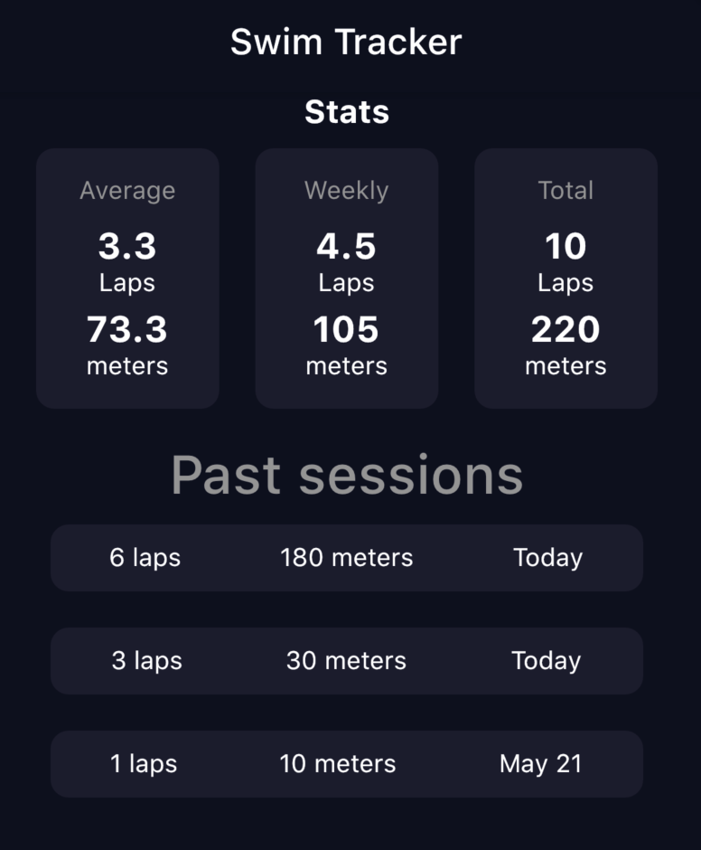
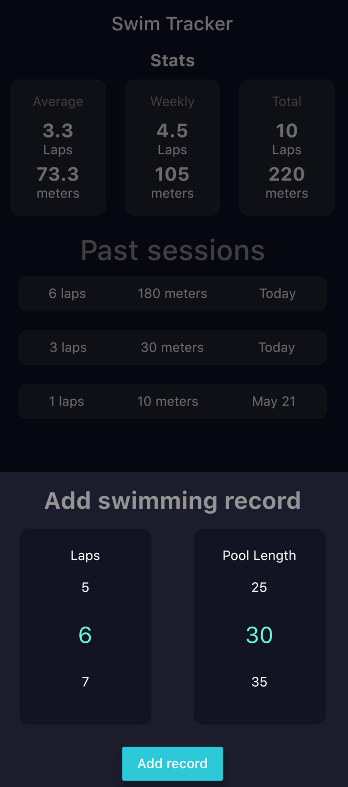

# Swim Tracker

App where you can track how much you swam

## Usage

To use the app you have to add the amount that you swam. For this you have to add how many laps you did 
and what is the pool length, using that information, the app calculates (length * laps) the total amount you swam.

To modify a record, slide the record to its left and it will open the modification menu.

To delete a record, slide it to its right.

## Stats

The app show you the stats of how much you swam in average, the average for this week, and the total sum 
of all your records.

## Download

You can find the latest download in the 
[build section](https://github.com/Bullrich/Swim-Tracker/actions?query=branch%3Amaster) of the latest action.